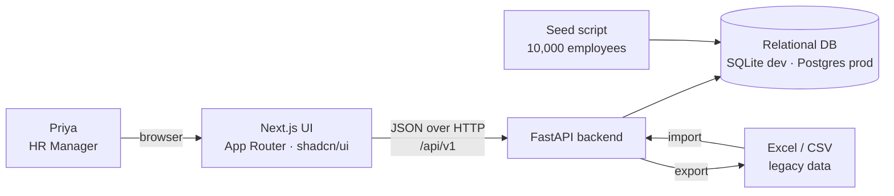
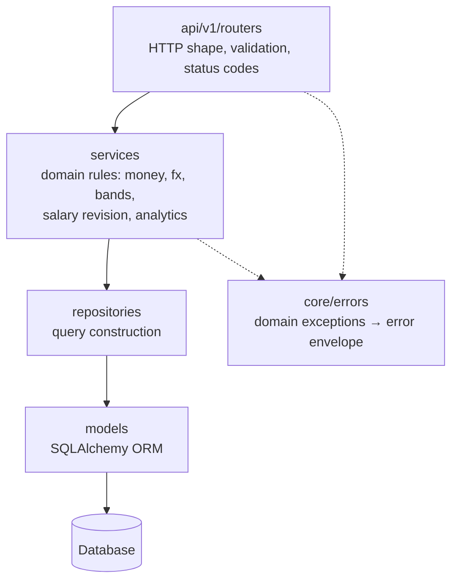
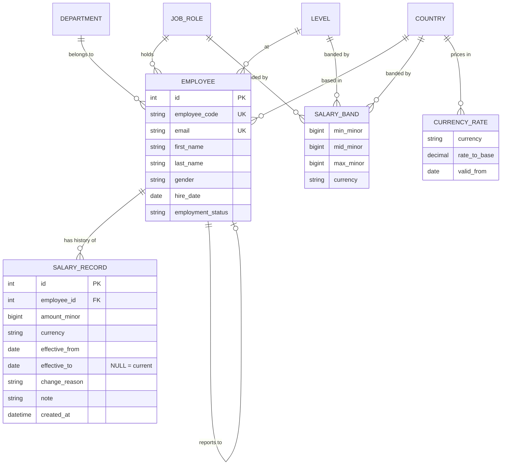
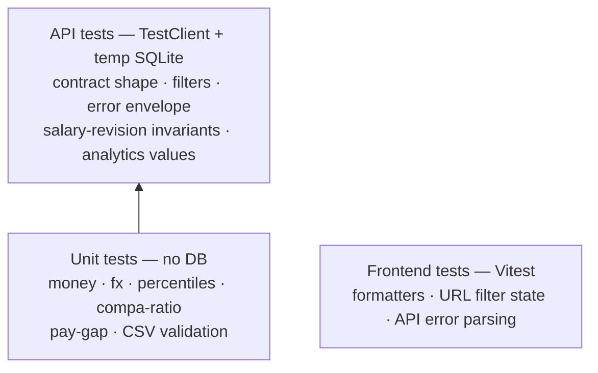
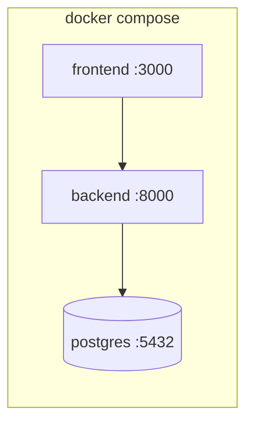

# Architecture — ACME Salary Management

## 1. System context

The UI holds no business logic. Every derived compensation figure — normalised amounts,
compa-ratio, percentiles, pay gaps, band classification — is computed server-side, so the
numbers are identical whether they are read on screen, exported to CSV, or queried directly.

## 2. Backend components

Rules the layering enforces:
- **Routers** never build SQL and never do arithmetic. They translate HTTP to service calls.
- **Services** hold every domain rule and are unit-testable with no database. This is where the
  interesting tests live.
- **Repositories** own query construction, including the FX join, so aggregation stays in SQL.
- **Domain exceptions** are raised in services and mapped to the contract's error envelope by a
  single handler, so error shape can't drift endpoint to endpoint.

## 3. Data model

### Three decisions that shape everything

**Money as integer minor units.** `amount_minor: BigInteger` + ISO-4217 `currency`. Floating
point cannot represent currency exactly, and a salary system that is off by a cent in
aggregate is not credible. Conversion happens once at the API boundary using `Decimal` with
explicit rounding, and amounts cross the wire as strings so JavaScript's float parsing can't
reintroduce the problem. → `docs/decisions/ADR-001-money-representation.md`

**Salary as an effective-dated, append-only timeline.** `effective_to IS NULL` marks the
current record; a raise closes the open row and inserts a new one in a single transaction. The
naive alternative — a `salary` column on `employee` — makes history, audit and "what did we pay
in March?" impossible to reconstruct, and those are exactly the questions an HR manager asks.
The cost is that "current salary" is a join rather than a column, paid for with a partial index
on `(employee_id) WHERE effective_to IS NULL`. → `ADR-002-effective-dated-salary.md`

**Currency normalisation inside SQL.** A dated `currency_rates` table joined during aggregation,
rather than converting in Python. Cross-country comparison is the point of the product, and
pulling 10,000 rows into the application to compute a median would not survive the brief's
scale requirement. → `ADR-003-fx-normalisation.md`

## 4. How the app stays fast at 10,000 employees

| Concern | Approach |
|---|---|
| Employee list | Server-side pagination (`limit` ≤ 100), filters and sort pushed to SQL; count issued as a separate query; the UI never receives more than a page |
| Current salary lookup | Partial index on `salary_records(employee_id) WHERE effective_to IS NULL` |
| Filter columns | Indexes on the FK columns used by facets (department, country, job role, level, status) |
| Aggregation | `GROUP BY` in SQL with the FX join applied inline; nothing loaded into Python |
| Percentiles | `percentile_cont` on Postgres; on SQLite an isolated fallback that selects only the single ordered salary column |
| Seeding | Batched bulk inserts with a fixed RNG seed — fast, and identical every run so tests and screenshots are stable |

## 5. Testing strategy

The pyramid is deliberately bottom-heavy. The compensation maths is where correctness actually
matters and where a bug would be invisible in a demo, so it is tested exhaustively as pure
functions with table-driven cases. API tests then assert the contract and the transactional
invariants against a fixture organisation small enough that every expected number is written
out by hand rather than snapshotted.

## 6. Deployment

One command brings up the stack and seeds the database. The backend is dialect-agnostic, so the
same image runs against SQLite for local development and Postgres in the composed stack.
See `README.md` for the deployment walkthrough.
